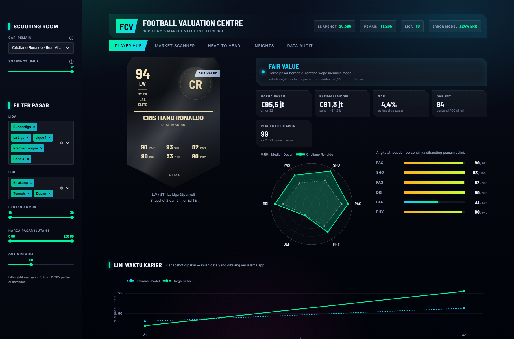
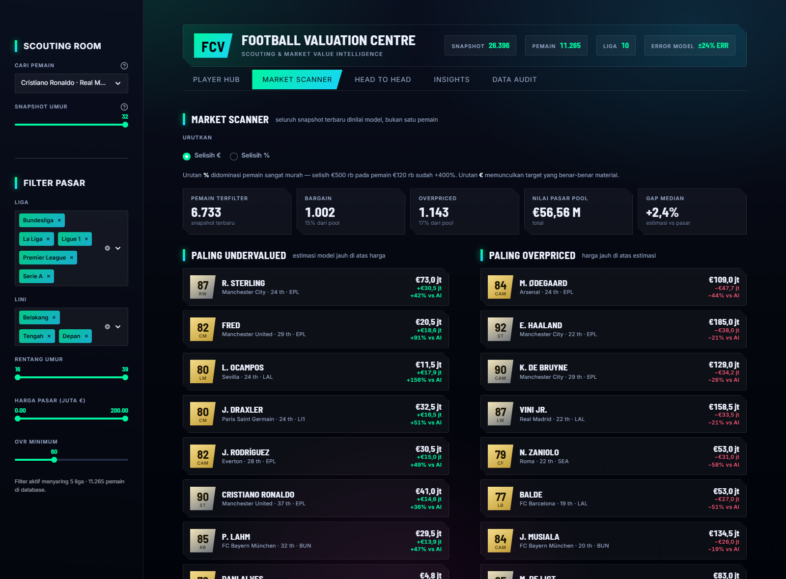
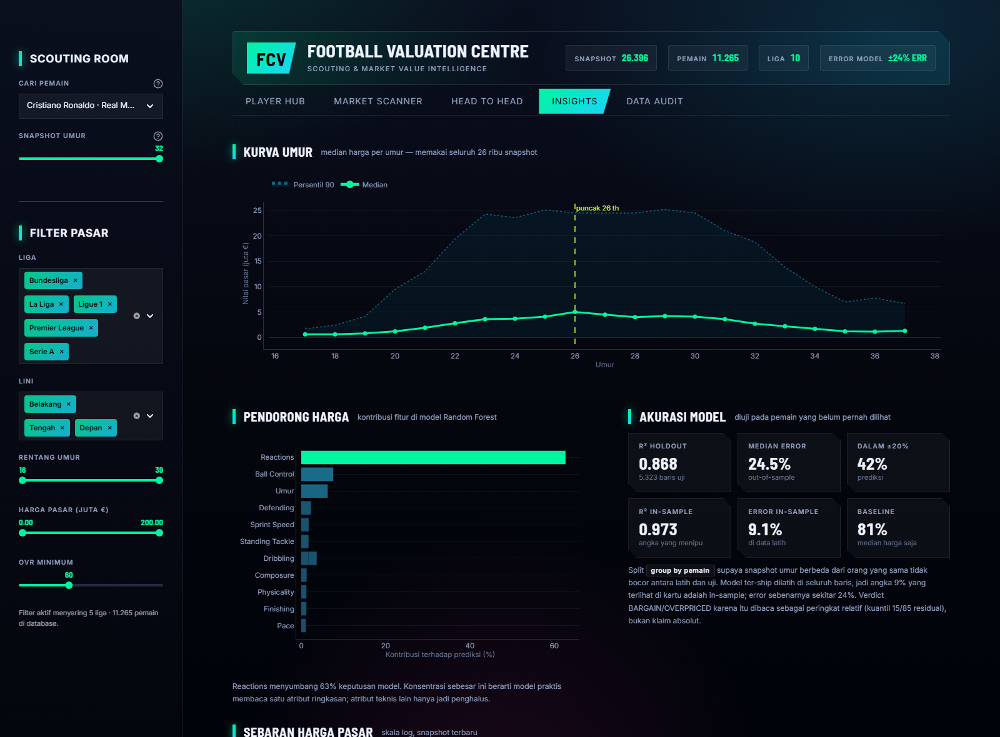
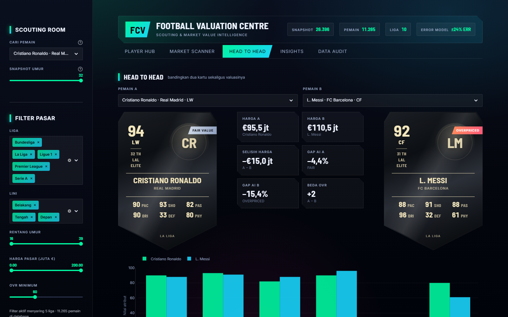

<div align="center">

# ⚽ Football Valuation Centre

**Dashboard scouting & valuasi harga pasar pemain sepak bola, dengan antarmuka bergaya EA FC Ultimate Team.**

Menilai 26.396 snapshot pemain dari 10 kompetisi memakai model Random Forest,
lalu menandai siapa yang harganya di bawah dan di atas estimasi.

[](https://www.python.org/)
[](https://streamlit.io/)
[](https://scikit-learn.org/)
[](https://plotly.com/python/)




</div>

---

## Apa ini

Ambil satu pemain, dapatkan kartu ala Ultimate Team lengkap dengan enam stat, lalu
bandingkan harga pasarnya dengan estimasi model. Atau balik arahnya: sapu seluruh
liga sekaligus untuk mencari pemain yang paling salah harga.

Model membaca 25 atribut teknis (pace, shooting, reactions, ball control, umur, dan
seterusnya) lalu memprediksi nilai pasar dalam euro. Selisih antara harga
sesungguhnya dan prediksi itulah sinyal yang ditampilkan.

Yang membedakan proyek ini dari dashboard "tempel model ke Streamlit" biasa: **datanya
diaudit dulu, dan akurasi modelnya dilaporkan apa adanya** — termasuk bagian yang
tidak enak didengar.

## Tiga masalah data yang ketemu saat audit

Dataset yang dipakai (`data_pemain_siap_pakai.csv`) ternyata punya tiga cacat serius
yang membuat versi awal app ini menyesatkan. Semuanya sudah diperbaiki dan
didokumentasikan di dalam tab **Data Audit**.

<table>
<tr><td width="30"><b>1</b></td><td>

**Label liga tercampur antarnegara.** Nama liga di dataset asli sudah dipotong prefix
negaranya, sehingga *Brazilian Serie A* melebur ke *Serie A*, *Russian Premier League*
ke *Premier League*, dan *Austrian Bundesliga* ke *Bundesliga*. Akibatnya Santos,
Zenit St. Petersburg, dan Rapid Wien tampil sebagai klub liga top 5 — dan filter liga
di app jadi salah. **73 klub** dipetakan ulang ke kompetisi dan negara aslinya:
32 Brasil, 19 Rusia, 17 Austria, 3 Afrika Selatan, 2 Ukraina.

</td></tr>
<tr><td><b>2</b></td><td>

**67% baris data terbuang sia-sia.** Setiap baris sebenarnya satu edisi/musim pemain —
Mbappé muncul 8 kali, dari umur 17 di Monaco (€3,1 jt) sampai 24 di PSG (€181,5 jt).
Versi awal memakai `drop_duplicates(subset=['short_name'])` dan hanya menyisakan
8.746 baris termahal, membuang **17.651 baris** beserta seluruh informasi
perkembangan umur. Sekarang semua dipakai, dan justru itu yang menghidupkan kurva
umur, lini waktu karier, serta percentile per lini.

</td></tr>
<tr><td><b>3</b></td><td>

**Tidak ada kolom `overall`.** Kartu EA FC butuh angka besar itu, jadi OVR
direkonstruksi dari `0,45 × movement_reactions + 0,55 × komposit bobot posisi` atas
enam stat kartu. Hasilnya wajar: Ronaldo 94, Messi 94, Mbappé 92, Haaland 92 —
korelasi **0,905** terhadap log harga, lebih baik dari reactions sendiri (0,83).
Tetap sebuah estimasi, bukan OVR resmi EA.

</td></tr>
</table>

## Kejujuran model

Model dilatih memakai seluruh baris CSV, jadi skor apa pun yang dihitung di data yang
sama adalah **in-sample** dan pasti terlihat mengagumkan. `scripts/evaluate_model.py`
melatih ulang Random Forest pembanding dengan split **group by pemain** — supaya
snapshot umur 23 dan 24 dari orang yang sama tidak bocor antara data latih dan uji.

| Skenario | R² | Median error | Dalam ±20% |
|---|---:|---:|---:|
| **Holdout — pemain belum pernah dilihat** | **0,868** | **24,5%** | **42%** |
| Model ter-ship, dihitung di data latihnya sendiri | 0,973 | 9,1% | 78% |
| Baseline: tebak median harga saja | −0,128 | 81,4% | 10% |

Angka yang berlaku adalah baris pertama. Error sebenarnya sekitar **±24%**, bukan 9%.
Konsekuensinya langsung terasa di desain:

- Ambang verdict **tidak** memakai ±10% flat (median error model saja sudah 9%,
  jadi hampir separuh pemain akan ter-flag hanya karena derau). Yang dipakai adalah
  kuantil 15/85 sebaran residual, yaitu **−9% / +24%**, dan labelnya dibaca sebagai
  peringkat relatif — bukan klaim absolut.
- Panel akurasi ini tampil terbuka di dalam app, berdampingan dengan angka in-sample
  yang menipu, supaya perbedaannya jelas.

Satu catatan penting soal interpretasi: `movement_reactions` menyumbang **63%**
keputusan model. Artinya model praktis membaca satu atribut ringkasan saja, sementara
atribut teknis lain hanya jadi penghalus.

## Isi dashboard

| Tab | Isi |
|---|---|
| **Player Hub** | Kartu pemain, verdict harga, radar hexagon vs median lini, percentile enam stat, rincian 18 atribut, lini waktu karier, enam pemain berprofil serupa |
| **Market Scanner** | Leaderboard undervalued & overpriced dengan filter liga/lini/umur/harga/OVR, peta pasar log-log, papan agregat 10 liga |
| **Head to Head** | Dua kartu berdampingan, perbandingan atribut, dan selisih valuasinya |
| **Insights** | Kurva umur (puncak median di **26 tahun**), pendorong harga dari feature importance, panel akurasi model, sebaran harga, papan atas atribut |
| **Data Audit** | Laporan transparan: apa yang diperbaiki dari CSV mentah, beserta batasan yang tersisa |

<details>
<summary><b>Lihat screenshot tab lainnya</b></summary>

### Market Scanner
Urutan default memakai selisih **euro**, bukan persen. Alasannya: urutan persen
didominasi pemain sangat murah — selisih €500 rb pada pemain €120 rb sudah +400%,
padahal tidak material. Dengan urutan euro yang muncul adalah target nyata.



### Insights


### Head to Head


</details>

## Cara menjalankan

```bash
git clone https://github.com/rapiip/footballvaluation.git
cd footballvaluation
pip install -r requirements.txt
python -m streamlit run app.py
```

Buka `http://localhost:8501`. Model sudah ikut di dalam repo (28 MB, terkompresi
joblib), jadi tidak perlu unduh atau latih apa pun lebih dulu.

> [!NOTE]
> Perintahnya `python -m streamlit`, bukan `streamlit`, kalau direktori scripts
> Python belum masuk `PATH`.

> [!WARNING]
> Secara default Streamlit juga mengikat ke alamat jaringan lokal, artinya siapa pun
> di WiFi yang sama bisa membuka dashboard ini — tidak ada autentikasi sama sekali.
> Untuk pemakaian pribadi tambahkan `--server.address 127.0.0.1`. Sebelum dideploy ke
> publik, autentikasi wajib ditambahkan lebih dulu.

### Perintah lain

```bash
python -m pytest tests -q            # 33 test, ~4 detik
python scripts/evaluate_model.py     # hitung ulang model_metrics.json
python scripts/train_model.py        # latih ulang model dari CSV
python -m streamlit run legacy_app.py  # app versi awal, untuk pembanding
```

## Struktur proyek

```
footballvaluation/
├── app.py                      # dashboard 5 tab
├── fcv/
│   ├── config.py               # path, kamus perbaikan liga, konstanta
│   ├── data.py                 # pembersihan + pengayaan 26.396 baris
│   ├── ratings.py              # estimasi OVR, tier kartu, percentile, verdict
│   ├── model.py                # load model, prediksi massal, feature importance
│   ├── insights.py             # market scanner, pemain serupa, kurva umur
│   └── ui.py                   # komponen kartu HTML + chart Plotly bertema
├── assets/style.css            # tema EA FC: kartu clip-path, sistem tipografi
├── scripts/
│   ├── evaluate_model.py       # holdout group-aware -> model_metrics.json
│   └── train_model.py          # latih ulang model dari CSV
├── tests/
│   ├── test_fcv.py             # 28 test logika + integrasi data nyata
│   └── test_app_smoke.py       # 5 test: app render tanpa exception (AppTest)
├── data_pemain_siap_pakai.csv  # 26.397 baris × 30 kolom
├── model_rf_market_value.pkl   # Random Forest 100 pohon, 28 MB
└── model_metrics.json          # hasil evaluasi holdout
```

Logika murni dipisah dari lapisan tampilan: `ratings.py`, `data.py`, dan `insights.py`
tidak mengimpor Streamlit sama sekali, sehingga bisa diuji langsung tanpa menjalankan
app. `ui.py` hanya merakit HTML dan chart, `app.py` hanya menyusun tata letak.

## Catatan desain

Antarmuka meniru bahasa visual EA FC Ultimate Team: kartu perisai dengan `clip-path`,
gradien per tier (bronze/silver/gold/elite), OVR besar di kiri atas, dan grid enam
stat PAC/SHO/PAS/DRI/DEF/PHY. Dataset tidak punya foto pemain, jadi portrait diganti
monogram inisial dengan radial gradient — dibuat agar terlihat sengaja, bukan seperti
gambar gagal dimuat.

Tipografinya memakai dua typeface dengan pembagian tugas tegas: **Barlow Semi
Condensed** hanya untuk ukuran ≥16px (judul, angka besar, nama pemain), dan **Inter**
untuk semua teks ≤14px. Font condensed pada 11–12px dengan tracking lebar adalah
kombinasi terburuk untuk keterbacaan, jadi teks kecil tidak pernah memakai display
font. Angka memakai `tabular-nums` supaya kolom harga sejajar rapi.

## Batasan yang perlu diingat

- Dataset tidak menyimpan tahun edisi, jadi harga antar snapshot berasal dari ekonomi
  game yang berbeda dan **tidak** disesuaikan inflasi.
- Tidak ada ID pemain. Identitas dibentuk dari nama + posisi utama, menyisakan 27
  baris yang masih bertabrakan dari 26 ribu. Efek sampingnya, satu pemain bisa muncul
  sebagai dua entri kalau posisi utamanya berubah antaredisi (misal L. Messi CF dan RW).
- Klub yang terdata hanya klub yang bertahan di daftar akhir tiap liga, sehingga
  pemain di klub terdegradasi bisa hilang dari sebagian musim.
- Tidak ada kolom kebangsaan, tinggi, kaki dominan, maupun foto.
- Model hanya melihat 25 atribut. Faktor nyata seperti sisa kontrak, cedera, menit
  bermain, dan hype pasar tidak ada di dalam data.
- 1 baris kiper dibuang karena dataset tidak menyertakan atribut goalkeeping,
  sehingga enam stat kartunya tidak bermakna untuk posisi itu.

Dengan kata lain: ini alat eksplorasi dan latihan analisis data, bukan dasar
pengambilan keputusan transfer sungguhan.

---

<div align="center">
<sub>Dibangun dengan Streamlit, scikit-learn, dan Plotly · data atribut pemain berasal dari dataset FIFA publik</sub>
</div>
